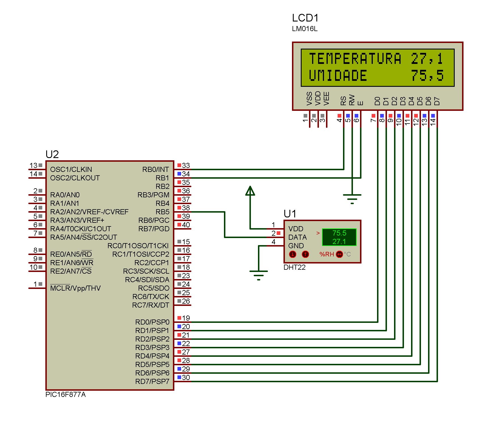

## Assembly code for serial communication between PIC16F877A and DHT22

The physical circuit assembled is shown by the figure below!

### Hardware configuration
- PIC16F877A 40 pins;
- LCD Display 16x2 8 bit connection;
- 4 MHz oscillator crystal;
- 22 pF ceramic disc capacitors.
### PIC Peripheral features used in this work
- TIMER0 Module;
- TIMER1 Module;

An Assembly source code was developed to establish a communication protocol between the sensor module DHT22 (AM2302) and the PIC16F877A Microchip microcontroller. The reading values are shown on an LCD display, connected to microcontroller by 8 bit connection, as shown by the figure below.

___
### DHT22 Data Reading

The DHT22 module sensor send the reading values after a 18ms low level signal sent by the microcontroller. The figure below shows the start signal sent by the microcontroller (orange line), followed by sensor response (blue line), which starts with two alternating bits of 80us each.

After that, the reading values are sent by the sensor as 16-bits numbers in a 40-bits set, which contains the relative humidy, temperature, and an 8-bit number for checksum, respectively.

The figure below shows the bit sequence sent by the sensor, as well as the division of bytes.

### Reading Sequence

The developed program reads the sent bytes through the logic represented by the flowchart in the figure below.
